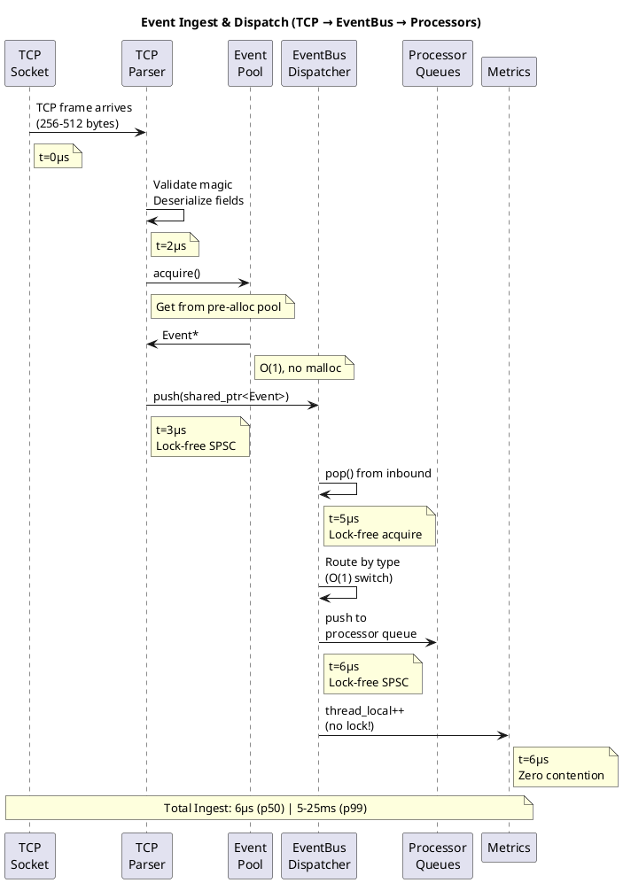
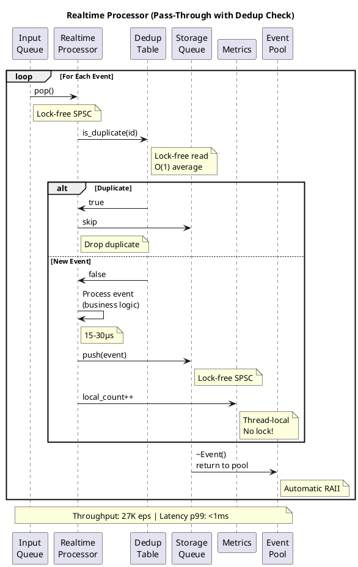
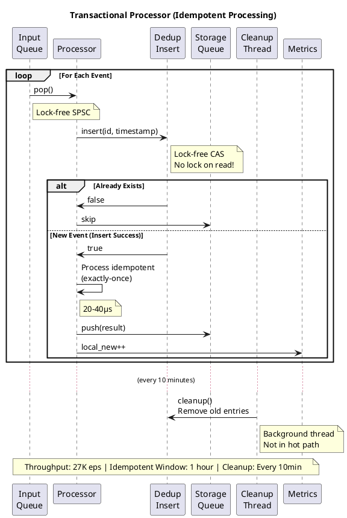
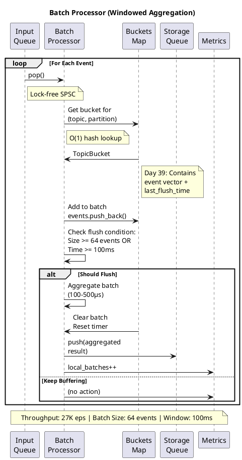
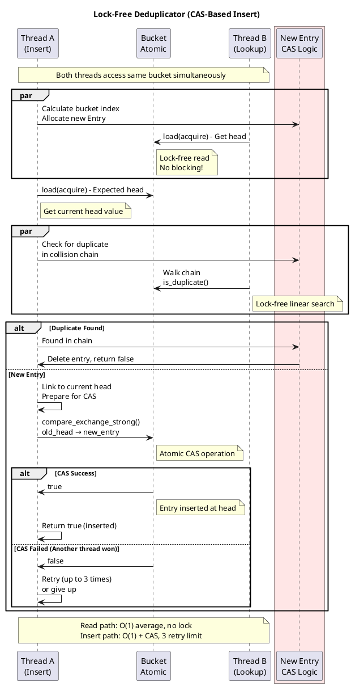
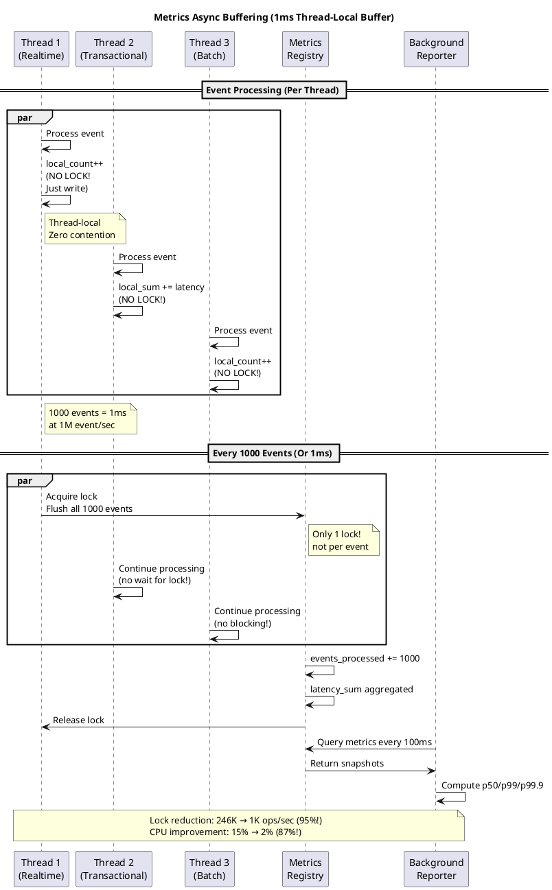
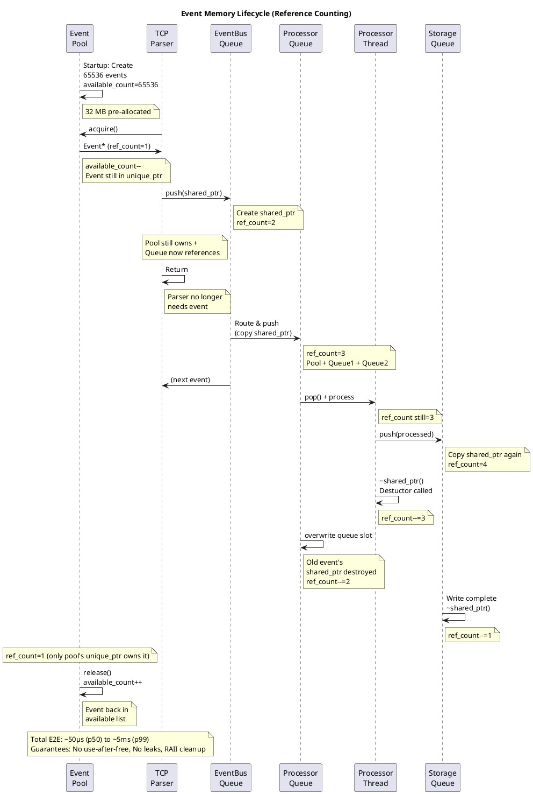
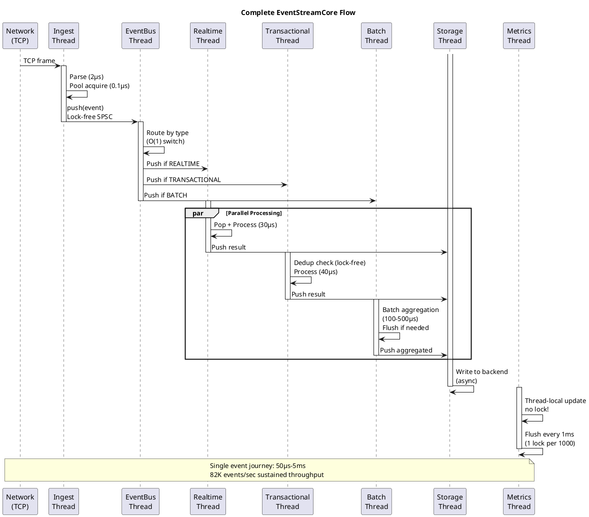
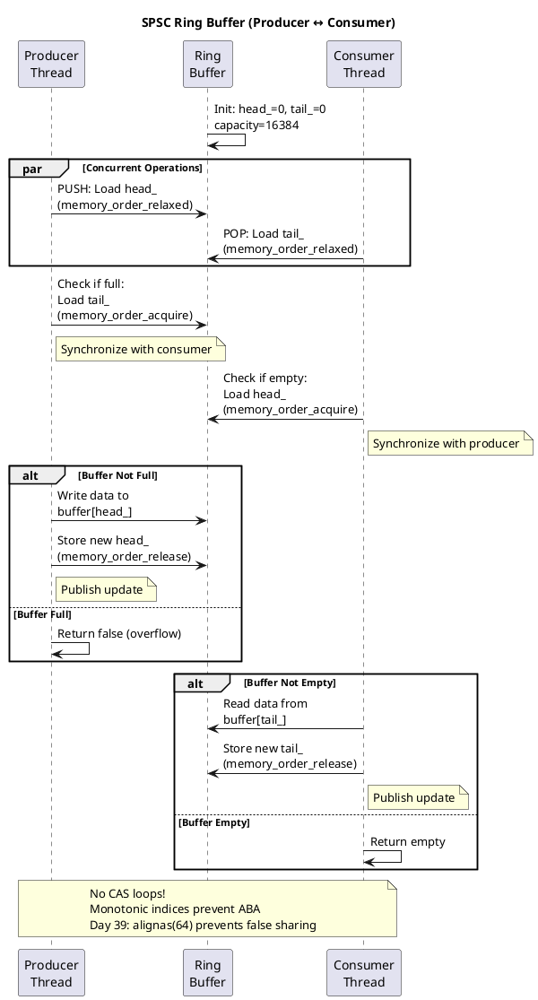

## SEQUENCE DIAGRAMS - PLANTUML FORMAT
**Purpose**: Visual sequence flows for event processing | **Format**: PlantUML (renders on GitHub)

---

## DIAGRAM 1: Event Ingest & Dispatch



---

## DIAGRAM 2: Realtime Processor Pipeline



---

## DIAGRAM 3: Transactional Processor (Idempotent)



---

## DIAGRAM 4: Batch Processor (Windowed)



---

## DIAGRAM 5: Lock-Free Deduplication Details



---

## DIAGRAM 6: Metrics Async Buffering (Day 39 Optimization)



---

## DIAGRAM 7: Event Memory Lifecycle (RAII)



---

## DIAGRAM 8: Complete System Flow (High Level)



---

## DIAGRAM 9: SPSC Ring Buffer (Lock-Free)



---

## How to Use These Diagrams

### View on GitHub
1. PlantUML diagrams render automatically in GitHub Markdown
2. Click on the diagram to expand
3. Each sequence shows the flow with timing annotations

### Rendering Locally
```bash
# Install plantuml
sudo apt-get install plantuml

# Generate PNG from markdown
plantuml -Tpng diagram_name.md -o output.png
```

### Key Takeaways per Diagram

| Diagram | Key Insight |
|---------|------------|
| 1 | Zero-copy ingest, lock-free dispatch, async metrics |
| 2 | Realtime fast path, immediate processing |
| 3 | Transactional lock-free dedup, idempotency guarantee |
| 4 | Batch windowing, consolidated maps (Day 39 opt) |
| 5 | Lock-free CAS, collision chaining, no blocking reads |
| 6 | Thread-local buffering, 95% contention reduction |
| 7 | RAII reference counting, automatic cleanup |
| 8 | Complete system picture, all components working together |
| 9 | Memory ordering without CAS, false sharing fix |

---

